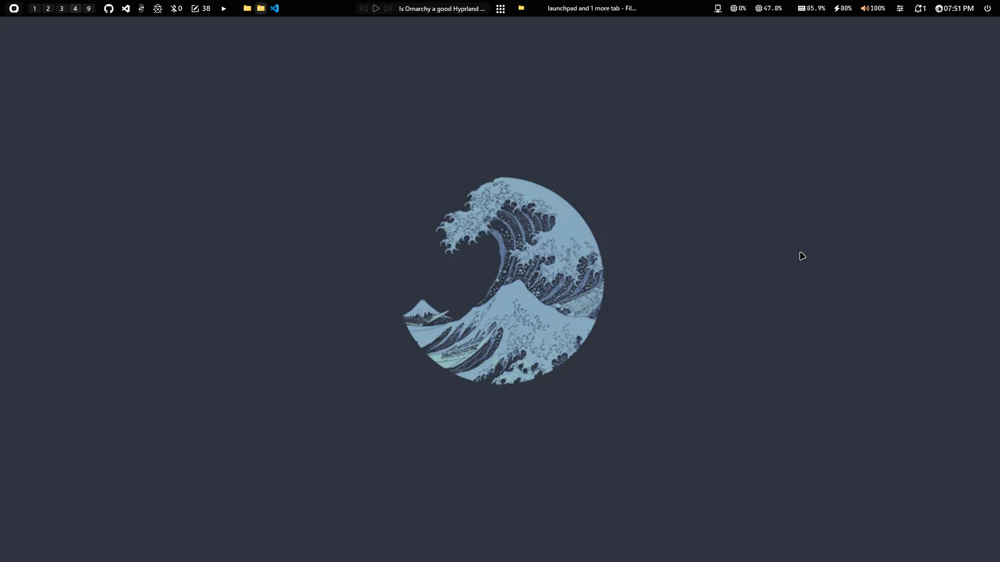

<div align="center">

# <span style="color: #5dd39e">✨ Configs Collection ✨</span>



---

### 🎨 <span style="color: #5dd39e">Clean</span> 🌙 <span style="color: #7fe9d4">Themed</span> 🚀 <span style="color: #00c9a7">Configurations</span>

</div>

## <span style="color: #5dd39e">📁 Repository Structure</span>

```
├─ 📁 apps/                    # Application-specific configurations
│  ├─ 📁 productivity/        # Productivity tools
│  │  ├─ 📁 yasb/            # Yet Another Status Bar configuration
│  │  └─ 📁 glazewm/         # GlazeWM tiling window manager configuration
│  ├─ 📁 terminal/            # Terminal and shell configurations
│  ├─ 📁 browsers/            # Browser configurations
│  └─ 📁 editors/             # Text editor configurations
├─ 📁 apps/system/            # System-level tools
├─ 📁 scripts/                # Setup and maintenance scripts
├─ 📁 templates/              # Template files for new projects
├─ 📁 docs/                   # Documentation
└─ 📁 tools/                  # Enhancement tools
```

## <span style="color: #00c9a7">🛠️ Included Configurations</span>

### <span style="color: #7fe9d4">**Desktop Environment**</span>
- <span style="color: #5dd39e">🪟 **YASB**</span> - Custom status bar with system monitoring
- <span style="color: #5dd39e">🪟 **GlazeWM**</span> - Tiling window manager for efficient window management

### <span style="color: #7fe9d4">**Terminal & Shell**</span>
- <span style="color: #5dd39e">🖥️ **Windows Terminal**</span> - Customized terminal appearance and behavior
- <span style="color: #5dd39e">🐚 **PowerShell**</span> - Customized PowerShell profile and settings
- <span style="color: #5dd39e">📊 **Fastfetch**</span> - System information tool configuration

### <span style="color: #7fe9d4">**Productivity Tools**</span>
- <span style="color: #5dd39e">🔍 **Flow Launcher**</span> - Customized launcher with theme
- <span style="color: #5dd39e">🔍 **Everything**</span> - Fast file search utility configuration
- <span style="color: #5dd39e">📷 **ShareX**</span> - Screen capture and productivity tool settings
- <span style="color: #5dd39e">📤 **LocalSend**</span> - Secure local file sharing tool configuration
- <span style="color: #5dd39e">📦 **UniGetUI**</span> - Package manager frontend configuration

### <span style="color: #7fe9d4">**System Enhancement**</span>
- <span style="color: #5dd39e">⚙️ **WinToys**</span> - Windows optimization and debloating tool
- <span style="color: #5dd39e">🔧 **Winhance**</span> - Windows customization and debloating tool

## <span style="color: #5dd39e">🚀 Quick Setup</span>

### <span style="color: #00c9a7">Prerequisites</span>
- Git installed on your system
- Applications installed per tool requirements

### <span style="color: #00c9a7">Installation</span>
1. **Clone this repository:**
   ```bash
   git clone https://github.com/yourusername/Configs.git
   cd Configs
   ```
2. **Run the installation script:**
   ```bash
   scripts\install.ps1
   ```

## <span style="color: #7fe9d4">🔒 Security Notice</span>

<div style="background-color: #1e1e2e; border-left: 5px solid #5dd39e; padding: 10px; color: #cdd6f4; font-family: monospace;">
<span style="color: #5dd39e">✓</span> No sensitive information stored<br>
<span style="color: #5dd39e">✓</span> Safe for public sharing<br>
<span style="color: #5dd39e">✓</span> Environment variable based paths
</div>

## <span style="color: #5dd39e">🎨 Themed Configurations</span>

<div style="display: flex; justify-content: center; align-items: center; gap: 10px; padding: 10px; background-color: #1e1e2e; border-radius: 8px;">
  <div style="width: 20px; height: 20px; background-color: #5dd39e; border-radius: 50%;"></div>
  <div style="width: 20px; height: 20px; background-color: #7fe9d4; border-radius: 50%;"></div>
  <div style="width: 20px; height: 20px; background-color: #00c9a7; border-radius: 50%;"></div>
  <div style="width: 20px; height: 20px; background-color: #00b894; border-radius: 50%;"></div>
  <div style="width: 20px; height: 20px; background-color: #00a581; border-radius: 50%;"></div>
  <div style="width: 20px; height: 20px; background-color: #00d9a1; border-radius: 50%;"></div>
  <div style="width: 20px; height: 20px; background-color: #5dd39e; border-radius: 50%;"></div>
  <div style="width: 20px; height: 20px; background-color: #7fe9d4; border-radius: 50%;"></div>
</div>

## <span style="color: #00c9a7">✨ Features</span>

<span style="color: #5dd39e">✓</span> **Modular Design** - Each tool has its own isolated configuration<br>
<span style="color: #5dd39e">✓</span> **Version Controlled** - Track changes to your environment<br>
<span style="color: #5dd39e">✓</span> **Portable** - Easy to replicate across systems<br>
<span style="color: #5dd39e">✓</span> **Visual Consistency** - Coordinated theme across tools<br>
<span style="color: #5dd39e">✓</span> **Documented** - Clear usage instructions<br>
<span style="color: #5dd39e">✓</span> **Secure** - No sensitive data exposure<br>

---

<div align="center">

### <span style="color: #5dd39e">🌟</span> <span style="color: #00c9a7">Build your own Configs</span> <span style="color: #7fe9d4">🌟</span>


</div>